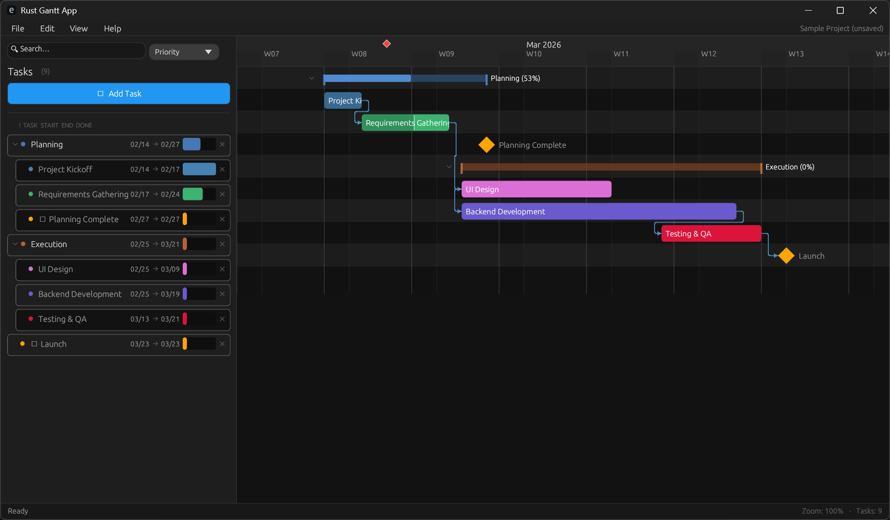

# Rust Gantt App

A native Gantt chart desktop application built with Rust and [egui](https://github.com/emilk/egui). Fast, lightweight, and fully themeable.



> **⚠️ Disclaimer:** This project has been 100% vibe coded. Use at your own risk!

## Features

**Gantt Chart**

- Colored task bars with progress indicators
- Summary/parent bars for grouped work
- Parent/child task hierarchy (single-level subtasks)
- Collapse/expand task groups
- Milestone diamonds (◆) for key dates
- Dependency arrows between tasks with routed polylines
- Drag to move or resize task bars
- Drag-to-reorder tasks vertically with smooth animation
- Shift+drag between bars to create dependency links
- Add dependencies from the editor (FS/SS/FF/SF picker)
- Right-click a dependency arrow to remove it
- Right-click task menus (add subtask, delete task/group)
- Today-line marker with diamond indicator
- Weekend shading bands
- Alternating row backgrounds
- Sticky timeline header

**Timeline**

- Day, Week, and Month scale modes
- Zoom in/out with Ctrl+Scroll (2–80 pixels per day)
- Responsive scaling of rows and UI elements with zoom level

**Task Editing**

- Side panel with task list and inline editor
- Name, dates, progress slider, color palette, milestone toggle
- Add and delete tasks + subtasks
- Auto-calculated parent dates/progress (read-only on parent tasks)
- View and manage dependencies per task

**File Operations**

- Save/Load projects as `.gantt.json` files
- Native file dialogs
- CSV import with auto-delimiter detection and flexible header matching
- CSV export

**Theme Engine**

- JSON-based theme system with 160+ configurable values
- 5 built-in themes: Default Dark, Midnight, Warm Earth, Dark Material, Clean Light
- Drop custom `.json` theme files into the themes folder
- Switch themes live from the View menu
- Partial themes supported — override only what you need

## Getting Started

### Prerequisites

- [Rust](https://rustup.rs/) (stable toolchain)

### Build & Run

```bash
cargo run --release
```

Or for development:

```bash
cargo run
```

## Keyboard Shortcuts

| Shortcut    | Action                            |
| ----------- | --------------------------------- |
| Ctrl+S      | Save project                      |
| Ctrl+Scroll | Zoom in/out                       |
| Shift+Drag  | Create dependency between tasks   |
| Right-click | Open task/dependency context menu |
| Escape      | Close dialogs                     |

## Custom Themes

Themes are stored as JSON files in your OS config directory:

- **Windows:** `%APPDATA%\RustGanttApp\config\themes\`
- **macOS:** `~/Library/Application Support/RustGanttApp/config/themes/`
- **Linux:** `~/.config/RustGanttApp/config/themes/`

A reference file (`_reference_default.json`) is generated on first launch with all available theme keys. To create a custom theme:

1. Copy the reference file and rename it (e.g. `my_theme.json`)
2. Edit the values you want to change — all fields have `#[serde(default)]`, so you only need to include the ones you're overriding
3. Click **View → Reload Themes** or restart the app

## CSV Import

The importer auto-detects delimiters (comma, semicolon, tab) and flexibly matches common header names:

| Field    | Recognized Headers                                          |
| -------- | ----------------------------------------------------------- |
| Name     | `name`, `task`, `label`, `title`, `description`, `activity` |
| Start    | `start`, `from`, `begin`                                    |
| End      | `end`, `to`, `finish`, `due`                                |
| Progress | `status`, `state`, `progress`, `stage`, `phase`             |

Multiple date formats are supported: `YYYY-MM-DD`, `DD/MM/YYYY`, `MM/DD/YYYY`, `DD-MM-YYYY`, `DD.MM.YYYY`, and more.

## Project Structure

```
src/
├── main.rs          # Entry point
├── app.rs           # Application state and main update loop
├── model/           # Data model (tasks, dependencies, timeline)
├── ui/              # UI components
│   ├── gantt_chart.rs   # Gantt chart rendering and interactions
│   ├── task_table.rs    # Task list panel
│   ├── task_editor.rs   # Inline task editor
│   ├── toolbar.rs       # Menu bar
│   ├── dialogs.rs       # Add Task and About dialogs
│   ├── theme.rs         # Theme accessor facade
│   ├── theme_def.rs     # Theme data structures
│   └── theme_manager.rs # Theme loading, saving, switching
└── io/              # File I/O (JSON project files, CSV import/export)
```

## License

This project is licensed under the MIT License — see the [LICENSE](LICENSE) file for details.
